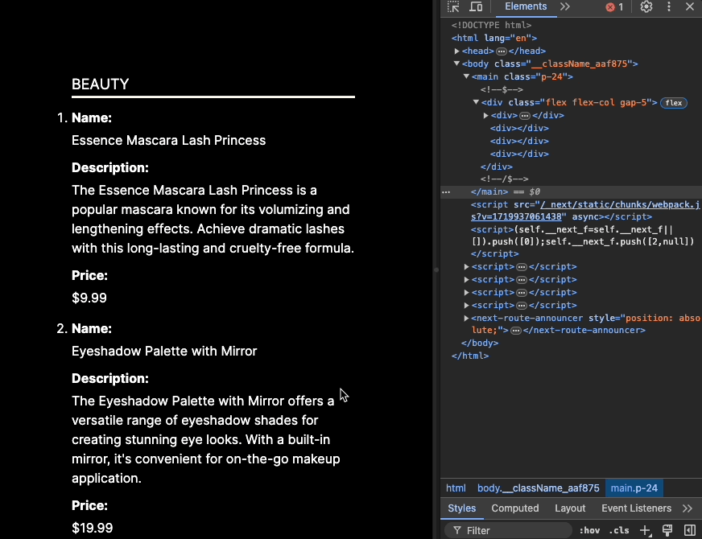

# Render When Visible in the Viewport

Um hook customizado do React e um componente render prop para renderizar componentes apenas quando eles estão visíveis na viewport, otimizando o desempenho em páginas onde componentes complexos são renderizados ao montar o componente.

## Índice

- [Descrição](#descrição)
- [Exemplo de Uso](#exemplo-de-uso)
- [Tecnologias Utilizadas](#tecnologias-utilizadas)
- [Instalação](#instalação)
- [Uso](#uso)

## Descrição

Este projeto fornece um hook customizado do React e um componente render prop para melhorar o desempenho ao renderizar componentes apenas quando eles estão visíveis na viewport. Ele utiliza a Intersection Observer API para determinar a visibilidade.

Essa abordagem pode ser utilizada para:
- Executar animações apenas quando os componentes estão visíveis na viewport do usuário.
- Reduzir o carregamento inicial da página, atrasando a renderização de componentes complexos até que eles sejam realmente necessários.
- Melhorar a experiência do usuário em páginas longas ou de rolagem infinita, onde muitos componentes são carregados dinamicamente.

## Exemplo de Uso

No exemplo fornecido no projeto, estamos utilizando uma chamada para a API [dummyjson](https://dummyjson.com) para listar produtos. À medida que o usuário faz scroll pela página, as categorias e seus respectivos produtos são renderizados na tela somente quando se tornam visíveis na viewport.

O GIF abaixo ilustra esse comportamento. Você pode observar que, na aba "Elementos" do browser, os produtos são renderizados sob demanda, o que demonstra a eficiência desta abordagem em otimizar o desempenho da aplicação.




O exemplo contido no projeto utiliza uma chamada para a API [dummyjson](https://dummyjson.com/) para listar produtos. As categorias e seus respectivos produtos só são renderizados na tela quando se tornam visíveis na viewport.

## Tecnologias Utilizadas

- NextJS
- Intersection Observer API
- TailwindCSS

## Instalação

Para começar a usar este projeto, clone o repositório e instale as dependências:

```bash
git clone https://github.com/bmenegidio/render-when-visible-in-the-viewport.git
cd render-when-visible-in-the-viewport
npm install
```

## Uso
Usando o Componente Render Prop:

```jsx
import { ShowWhenVisibleProvider } from '@/components/renderProps/showWhenVisible';

const MyComponent = () => (
    <ShowWhenVisibleProvider
      render={({ isIntersecting }) => <RenderedOnlyWhenVisible />}
    />
);
```
